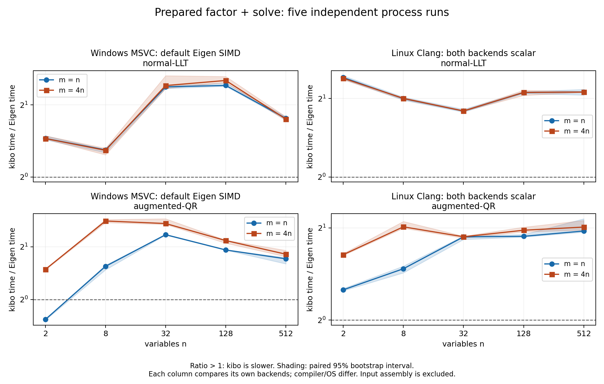

# 連続行カーネル改善後のPC性能比較

この報告はsource2462796の中間測定。発見したLLTの悪化を修正した
[LLT処理選択修正後のPC性能比較](2026-10-07-dispatch-performance.md)を最新結果とする。

2026-10-07。改善後のコアでWindows主比較とLinux scalar比較を各5 process実行した。
全10形状で通常性能fixtureの独立解照合と数値容量64 MiB以下を満たした。
悪条件・大残差の数値suiteは引き続き失敗しており、初期保証全体の受入は未完了。
この結果をEigen全体や未知のworkloadへの速度優位として一般化しない。

## LM参照fit

中央差分step1e-6*(1+|parameter|)、tolGradient1e-6、最大100反復、初期lambda1e-3、D=I。
受理時lambda0.3倍（下限1e-15）、棄却時10倍。両solverは同じ設定を使う評価harness。
直線は初期[0,0]、指数は初期[1,1]から、4ケースすべて2反復で受入条件を満たした。
[最終parameter/cost/iterationsのraw JSON lines](performance/contiguous/lm-reference.txt)と[CI source/input log hash](performance/contiguous/lm-source.json)を保存した。
直線はslope1.96999995/intercept0.090000177、cost0.0155、指数はa1.00159214/b0.99961800、cost0.000262088。
optimizer製品APIとnumopt-js連携の実装は今回の範囲に含めない。

## 固定した条件

- CPU: Intel Core i9-14900K（24 cores / 32 logical processors）。
- 主比較: Windows11 Pro 10.0.26200、MSVC19.44.35222.0、Release /O2 /fp:precise、core SSE2と通常Eigen x64 SIMD。
- scalar比較: 同じPCのDocker Linux Debian13、Clang20.1.8/libc++20.1.8、Release -O3、両backendの明示SIMDと自動vectorizationをoff。compiler/OS差があるため主系列と合算しない。
- Eigen5.0.1 commit bc3b39870ecb690a623a3f49149a358b95c5781d、single-thread、fast-math off。
- 測定source: 2462796ad42f97c4dd569b3393ca7f8be7e70985。記録した8 sourceのSHA256をcommitのgit blobと照合した。
- xorshift seed0x6b69626f、n=2/8/32/128/512、m=n/4n、condition<=100を独立確認、lambda1e-3、D=I。両系列の10 fixture hashはすべて一致。
- warmup5、30 samples、各sample20ms以上の固定batch、backend順を交替した5 process。解を別のEigen LDLTにrelative error1e-8以内で照合してから測定。
- coreはrow-major、Eigenはcolumn-major。J/Gram/augmented入力とRHSの組立ては全phaseで時間外。LM反復全体の時間ではない。
- 中央値は5 process medianの中央値、p95は各process p95の中央値。比率は同じprocessでのcore/Eigen比の中央値。95%区間は5 paired ratiosの10000回bootstrap。
- 容量は同時に生存する入力・出力・factor・copy・workspace等に、Eigen LLT内部packingの保守的上限を補った値。allocator管理領域やmodule/OS予約は含めない。

測定headers/CMake/fixture/harnessは[CI sourceb20118e](https://github.com/takuto-NA/kibo-linalg/actions/runs/37506029228)とbyte同一。
[測定方法](../benchmarks.md)と[実compile command・binary hash](performance/contiguous/build-commands.json)を参照。
未完了試行を集計せず、各系列80比較group・800 raw rowsを検証した。
集計時はraw checksum、case/run/backendの重複・欠落、時間、condition、容量を検査する。
隔離した検証で正常データを受理し、重複行・1行欠落・checksum不一致をそれぞれ拒否した。

既存の[Eigen LLTの容量監査](../research/eigen-capacity.md)に基づき、内部packingの追加上限を全caseへ反映した。
原CSVと時間は変更せず、raw numeric_bytesは明示buffer subtotal、summary numeric_bytesは監査後の上限を示す。

## 準備済みfactor + solve

時間単位はµs。比率1超ならcoreが遅い。小さい問題でもAPI検査を含む同じ実装を比較している。
scalar時間・各phaseのmedian/p95は全結果へのリンクで確認できる。

| n | m | solver | Windows core µs | Windows Eigen µs | Windows比 [95%区間] | scalar比 [95%区間] |
| ---: | ---: | --- | ---: | ---: | --- | --- |
| 2 | 2 | normal-LLT | 0.069 | 0.047 | 1.449 [1.431, 1.486] | 2.406 [2.372, 2.445] |
| 2 | 2 | augmented-QR | 0.143 | 0.186 | 0.768 [0.762, 0.771] | 1.256 [1.247, 1.268] |
| 2 | 8 | normal-LLT | 0.069 | 0.047 | 1.448 [1.439, 1.487] | 2.390 [2.359, 2.397] |
| 2 | 8 | augmented-QR | 0.317 | 0.214 | 1.486 [1.475, 1.489] | 1.636 [1.627, 1.650] |
| 8 | 8 | normal-LLT | 0.407 | 0.315 | 1.299 [1.265, 1.303] | 1.998 [1.970, 2.025] |
| 8 | 8 | augmented-QR | 1.605 | 1.040 | 1.547 [1.477, 1.571] | 1.471 [1.427, 1.501] |
| 8 | 32 | normal-LLT | 0.406 | 0.314 | 1.293 [1.238, 1.320] | 2.002 [1.982, 2.013] |
| 8 | 32 | augmented-QR | 3.827 | 1.354 | 2.811 [2.753, 2.865] | 2.017 [1.996, 2.101] |
| 32 | 32 | normal-LLT | 6.433 | 2.709 | 2.380 [2.343, 2.403] | 1.790 [1.773, 1.819] |
| 32 | 32 | augmented-QR | 27.970 | 11.910 | 2.347 [2.336, 2.354] | 1.870 [1.834, 1.883] |
| 32 | 128 | normal-LLT | 6.483 | 2.690 | 2.411 [2.344, 2.650] | 1.791 [1.784, 1.804] |
| 32 | 128 | augmented-QR | 71.792 | 26.497 | 2.719 [2.685, 2.895] | 1.872 [1.853, 1.880] |
| 128 | 128 | normal-LLT | 110.223 | 45.506 | 2.413 [2.393, 2.469] | 2.107 [2.091, 2.125] |
| 128 | 128 | augmented-QR | 880.853 | 458.539 | 1.919 [1.915, 1.922] | 1.878 [1.867, 1.904] |
| 128 | 512 | normal-LLT | 114.944 | 45.667 | 2.531 [2.483, 2.630] | 2.110 [2.054, 2.151] |
| 128 | 512 | augmented-QR | 2289.172 | 1058.441 | 2.172 [2.100, 2.185] | 1.966 [1.941, 2.012] |
| 512 | 512 | normal-LLT | 3453.994 | 1964.216 | 1.758 [1.737, 1.785] | 2.118 [2.060, 2.167] |
| 512 | 512 | augmented-QR | 47585.600 | 27651.200 | 1.708 [1.598, 1.737] | 1.954 [1.938, 2.143] |
| 512 | 2048 | normal-LLT | 3432.437 | 1960.138 | 1.747 [1.720, 1.786] | 2.116 [2.110, 2.129] |
| 512 | 2048 | augmented-QR | 144644.200 | 78477.600 | 1.815 [1.759, 1.909] | 2.013 [1.970, 2.116] |

## Eigenとの差

primary: factor+solveの20比較中19比較でcoreがEigenより遅い。
512変数・2048残差のnormal-LLTはEigen比1.747 [1.720, 1.786]。
512変数・2048残差のaugmented-QRはEigen比1.815 [1.759, 1.909]。
scalar: factor+solveの20比較中20比較でcoreがEigenより遅い。
512変数・2048残差のnormal-LLTはEigen比2.116 [2.110, 2.129]。
512変数・2048残差のaugmented-QRはEigen比2.013 [1.970, 2.116]。
性能差は縮まったが、Eigenの代替として速度優位を宣言する結果ではない。

[SVG](contiguous-performance-comparison.svg) · [PDF](contiguous-performance-comparison.pdf)

## 512変数の各phase

setupは組立て済み入力からのallocation/layout copy/factor/solveを含む。単位ms。

| 系列 | m | solver | phase | core median / p95 ms | Eigen median / p95 ms |
| --- | ---: | --- | --- | ---: | ---: |
| primary | 512 | normal-LLT | factor | 3.3596 / 3.4489 | 1.9405 / 1.9990 |
| primary | 512 | normal-LLT | solve | 0.0909 / 0.0944 | 0.0278 / 0.0288 |
| primary | 512 | normal-LLT | factor_solve | 3.4540 / 3.5747 | 1.9642 / 2.0417 |
| primary | 512 | normal-LLT | setup_copy_factor_solve | 4.1151 / 4.2914 | 2.7932 / 2.9065 |
| primary | 512 | augmented-QR | factor | 46.6269 / 48.1592 | 27.6751 / 29.5590 |
| primary | 512 | augmented-QR | solve | 1.5126 / 1.5520 | 0.1398 / 0.1480 |
| primary | 512 | augmented-QR | factor_solve | 47.5856 / 49.0897 | 27.6512 / 29.0363 |
| primary | 512 | augmented-QR | setup_copy_factor_solve | 49.4437 / 53.7749 | 30.0596 / 32.6012 |
| primary | 2048 | normal-LLT | factor | 3.3497 / 3.4417 | 1.9384 / 2.0374 |
| primary | 2048 | normal-LLT | solve | 0.0905 / 0.0956 | 0.0275 / 0.0281 |
| primary | 2048 | normal-LLT | factor_solve | 3.4324 / 3.5809 | 1.9601 / 2.0403 |
| primary | 2048 | normal-LLT | setup_copy_factor_solve | 4.1445 / 4.4626 | 2.8087 / 2.9205 |
| primary | 2048 | augmented-QR | factor | 131.4613 / 146.3450 | 78.2884 / 84.0178 |
| primary | 2048 | augmented-QR | solve | 4.8267 / 5.1063 | 0.3684 / 0.3796 |
| primary | 2048 | augmented-QR | factor_solve | 144.6442 / 151.6814 | 78.4776 / 83.0262 |
| primary | 2048 | augmented-QR | setup_copy_factor_solve | 140.8507 / 145.8919 | 89.9620 / 95.2358 |
| scalar | 512 | normal-LLT | factor | 6.1930 / 6.4509 | 2.9381 / 3.0939 |
| scalar | 512 | normal-LLT | solve | 0.1037 / 0.1087 | 0.0368 / 0.0384 |
| scalar | 512 | normal-LLT | factor_solve | 6.2597 / 6.5443 | 2.9652 / 3.1212 |
| scalar | 512 | normal-LLT | setup_copy_factor_solve | 6.9763 / 7.1735 | 3.9452 / 4.0499 |
| scalar | 512 | augmented-QR | factor | 71.6885 / 77.0314 | 36.5670 / 38.1110 |
| scalar | 512 | augmented-QR | solve | 1.2247 / 1.2718 | 0.2255 / 0.2306 |
| scalar | 512 | augmented-QR | factor_solve | 74.3715 / 78.1638 | 37.4131 / 41.3780 |
| scalar | 512 | augmented-QR | setup_copy_factor_solve | 78.8369 / 80.5509 | 39.3301 / 41.5246 |
| scalar | 2048 | normal-LLT | factor | 6.1659 / 6.3056 | 2.9392 / 3.0329 |
| scalar | 2048 | normal-LLT | solve | 0.1000 / 0.1024 | 0.0367 / 0.0378 |
| scalar | 2048 | normal-LLT | factor_solve | 6.2702 / 6.4388 | 2.9611 / 3.0514 |
| scalar | 2048 | normal-LLT | setup_copy_factor_solve | 6.3436 / 6.5912 | 3.2757 / 3.3696 |
| scalar | 2048 | augmented-QR | factor | 210.5177 / 232.2480 | 103.2823 / 107.1321 |
| scalar | 2048 | augmented-QR | solve | 5.6567 / 6.5339 | 0.6326 / 0.6731 |
| scalar | 2048 | augmented-QR | factor_solve | 217.9705 / 235.1280 | 106.8149 / 112.5429 |
| scalar | 2048 | augmented-QR | setup_copy_factor_solve | 223.7268 / 248.1643 | 117.4475 / 125.2223 |

Windowsの最大QRケースではfactorが約131 ms、solveが約4.83 ms。
solve単独のEigen比も約13倍と大きく、factorだけの改善では競合との差は残る。
phaseは別々にbatch測定するため、factorとsolveの中央値の和はfactor+solveと一致するとは限らない。

## 容量と変更前の比較

| 系列 | coreピーク数値bytes | Eigenピーク数値bytes | gate |
| --- | ---: | ---: | --- |
| primary | 50454528 | 60952576 | <=64 MiB pass |
| scalar | 50454528 | 60952576 | <=64 MiB pass |

準備済みLLT/QRはLinux Releaseでn=2〜512・m=n/4nの10構成、Windows Debugでn<=32の6構成の計算中allocator calls=0を確認した。
Clang ASan/UBSanでも全10構成を確認した。[実commandと結果](portability/hosted/contiguous/prepared-allocation.json)。
MSVC Releaseの確保probeはskipで、Eigenの内部確保0も保証していない。

変更前はsource29739d1の正式5-process Windows主比較。変更後も同じ測定器・入力hash・flagsを使う。
異なる時刻の実行なので旧/新比にpaired区間は付けず、Eigenとのpaired比較を各系列で示す。
[切り分けと採用処理](../research/contiguous-row-kernels.md)の短い診断は正式系列と混ぜない。

| m / n | solver | 変更前core ms | 変更後core ms | coreの改善倍率 | 変更前Eigen比 | 変更後Eigen比 |
| --- | --- | ---: | ---: | ---: | ---: | ---: |
| 512 / 512 | normal-LLT | 6.751 | 3.454 | 1.955 | 3.385 | 1.758 |
| 512 / 512 | augmented-QR | 143.679 | 47.586 | 3.019 | 5.128 | 1.708 |
| 2048 / 512 | normal-LLT | 6.770 | 3.432 | 1.972 | 3.426 | 1.747 |
| 2048 / 512 | augmented-QR | 390.754 | 144.644 | 2.701 | 4.997 | 1.815 |

workspace=LLT0/QR2n doubles、有限値検査、rank基準、無確保経路を維持した改善。
x86 SSE2の連続行処理とLLT8列panelを採用し、ESP/WASMや明示無効時のC++ fallbackを保持した。
通常hosted CIに絶対速度gateを置かず、固定PCで20%以上の悪化が95%区間込みで再現した場合にレビューする。

32変数LLTのWindows factor+solveは変更前比約1.20であり、大規模の改善と区別してレビューする。
scalarでは128変数LLTのfactor+solveが約23%悪化し、2変数LLTのfactor単独は約2倍となった。
通常SIMD・scalarの悪化条件を残した中間測定であり、処理選択の追加修正と再測定へ進む。
[全phaseの変更前比較と独立bootstrap](performance/contiguous/regression-review.json)に改善・悪化を併記する。

## 全結果・原証拠

- Windows: [summary CSV](performance/contiguous/primary/summary.csv)、[JSON](performance/contiguous/primary/summary.json)、[metadata](performance/contiguous/primary/metadata.json)、[SHA256](performance/contiguous/primary/summary-checksums.json)。
- Linux scalar: [summary CSV](performance/contiguous/scalar/summary.csv)、[JSON](performance/contiguous/scalar/summary.json)、[metadata](performance/contiguous/scalar/metadata.json)、[SHA256](performance/contiguous/scalar/summary-checksums.json)。
- 各directoryのrun-1〜5.csvはbackend/phase別のmedian・p95・batch calls・fixture hash・容量を保持する。
- [変更前の主系列](performance/primary/summary.csv)は履歴として保持する。未完了scalar試行と古い測定器による途中試行は正式比較へ採用しない。

この性能評価の完了だけでは、悪条件の精度gateとESP32各実機の受入を完了できない。
[初期受入状況](initial-acceptance.md)に残作業と証拠をまとめる。
