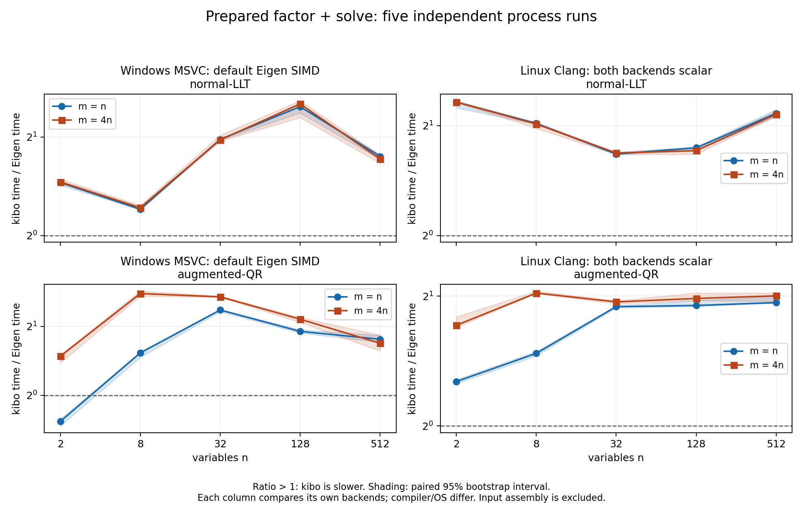

# LLT処理選択修正後のPC性能比較

2026-10-07。改善後のコアでWindows主比較とLinux scalar比較を各5 process実行した。
全10形状で通常性能fixtureの独立解照合と数値容量64 MiB以下を満たした。
悪条件・大残差の数値suiteは引き続き失敗しており、初期保証全体の受入は未完了。
この結果をEigen全体や未知のworkloadへの速度優位として一般化しない。

## LM参照fit

中央差分step1e-6*(1+|parameter|)、tolGradient1e-6、最大100反復、初期lambda1e-3、D=I。
受理時lambda0.3倍（下限1e-15）、棄却時10倍。両solverは同じ設定を使う評価harness。
直線は初期[0,0]、指数は初期[1,1]から、4ケースすべて2反復で受入条件を満たした。
[最終parameter/cost/iterationsのraw JSON lines](performance/dispatch/lm-reference.txt)と[CI source/input log hash](performance/dispatch/lm-source.json)を保存した。
直線はslope1.96999995/intercept0.090000177、cost0.0155、指数はa1.00159214/b0.99961800、cost0.000262088。
optimizer製品APIとnumopt-js連携の実装は今回の範囲に含めない。

## 固定した条件

- CPU: Intel Core i9-14900K（24 cores / 32 logical processors）。
- 主比較: Windows11 Pro 10.0.26200、MSVC19.44.35222.0、Release /O2 /fp:precise、core SSE2と通常Eigen x64 SIMD。
- scalar比較: 同じPCのDocker Linux Debian13、Clang20.1.8/libc++20.1.8、Release -O3、両backendの明示SIMDと自動vectorizationをoff。compiler/OS差があるため主系列と合算しない。
- Eigen5.0.1 commit bc3b39870ecb690a623a3f49149a358b95c5781d、single-thread、fast-math off。
- 測定source: 83c7a143599cd9e73bc97e6ecae3680daee3418f。記録した8 sourceのSHA256をcommitのgit blobと照合した。
- xorshift seed0x6b69626f、n=2/8/32/128/512、m=n/4n、condition<=100を独立確認、lambda1e-3、D=I。両系列の10 fixture hashはすべて一致。
- warmup5、30 samples、各sample20ms以上の固定batch、backend順を交替した5 process。解を別のEigen LDLTにrelative error1e-8以内で照合してから測定。
- coreはrow-major、Eigenはcolumn-major。J/Gram/augmented入力とRHSの組立ては全phaseで時間外。LM反復全体の時間ではない。
- 中央値は5 process medianの中央値、p95は各process p95の中央値。比率は同じprocessでのcore/Eigen比の中央値。95%区間は5 paired ratiosの10000回bootstrap。
- 容量は同時に生存する入力・出力・factor・copy・workspace等に、Eigen LLT内部packingの保守的上限を補った値。allocator管理領域やmodule/OS予約は含めない。

測定headers/CMake/fixture/harnessは[CI source83c7a14](https://github.com/takuto-NA/kibo-linalg/actions/runs/37511544075)とbyte同一。
[測定方法](../benchmarks.md)と[実compile command・binary hash](performance/dispatch/build-commands.json)を参照。
未完了試行を集計せず、各系列80比較group・800 raw rowsを検証した。
集計時はraw checksum、case/run/backendの重複・欠落、時間、condition、容量を検査する。
隔離した検証で正常データを受理し、重複行・1行欠落・checksum不一致をそれぞれ拒否した。

既存の[Eigen LLTの容量監査](../research/eigen-capacity.md)に基づき、内部packingの追加上限を全caseへ反映した。
原CSVと時間は変更せず、raw numeric_bytesは明示buffer subtotal、summary numeric_bytesは監査後の上限を示す。

## 準備済みfactor + solve

時間単位はµs。比率1超ならcoreが遅い。小さい問題でもAPI検査を含む同じ実装を比較している。
scalar時間・各phaseのmedian/p95は全結果へのリンクで確認できる。

| n | m | solver | Windows core µs | Windows Eigen µs | Windows比 [95%区間] | scalar比 [95%区間] |
| ---: | ---: | --- | ---: | ---: | --- | --- |
| 2 | 2 | normal-LLT | 0.069 | 0.047 | 1.452 [1.425, 1.468] | 2.321 [2.238, 2.333] |
| 2 | 2 | augmented-QR | 0.147 | 0.191 | 0.770 [0.736, 0.788] | 1.268 [1.253, 1.281] |
| 2 | 8 | normal-LLT | 0.069 | 0.047 | 1.458 [1.444, 1.489] | 2.322 [2.313, 2.342] |
| 2 | 8 | augmented-QR | 0.321 | 0.213 | 1.481 [1.386, 1.505] | 1.713 [1.693, 1.792] |
| 8 | 8 | normal-LLT | 0.383 | 0.317 | 1.203 [1.200, 1.226] | 2.029 [2.021, 2.043] |
| 8 | 8 | augmented-QR | 1.575 | 1.029 | 1.531 [1.464, 1.550] | 1.474 [1.454, 1.489] |
| 8 | 32 | normal-LLT | 0.384 | 0.315 | 1.217 [1.204, 1.236] | 2.021 [1.967, 2.039] |
| 8 | 32 | augmented-QR | 3.828 | 1.364 | 2.779 [2.710, 2.849] | 2.034 [2.029, 2.056] |
| 32 | 32 | normal-LLT | 5.266 | 2.678 | 1.968 [1.956, 1.977] | 1.673 [1.669, 1.690] |
| 32 | 32 | augmented-QR | 28.124 | 11.956 | 2.357 [2.317, 2.370] | 1.892 [1.880, 1.903] |
| 32 | 128 | normal-LLT | 5.265 | 2.676 | 1.960 [1.944, 2.029] | 1.684 [1.665, 1.690] |
| 32 | 128 | augmented-QR | 71.061 | 26.401 | 2.690 [2.676, 2.716] | 1.940 [1.921, 1.953] |
| 128 | 128 | normal-LLT | 111.650 | 45.045 | 2.477 [2.368, 2.487] | 1.740 [1.708, 1.751] |
| 128 | 128 | augmented-QR | 881.337 | 464.920 | 1.902 [1.870, 1.935] | 1.904 [1.894, 1.955] |
| 128 | 512 | normal-LLT | 114.905 | 45.035 | 2.525 [2.292, 2.582] | 1.709 [1.671, 1.744] |
| 128 | 512 | augmented-QR | 2275.103 | 1055.148 | 2.149 [2.081, 2.186] | 1.976 [1.956, 2.035] |
| 512 | 512 | normal-LLT | 3472.594 | 1997.519 | 1.746 [1.709, 1.771] | 2.161 [2.118, 2.214] |
| 512 | 512 | augmented-QR | 49174.850 | 27888.450 | 1.757 [1.706, 1.829] | 1.933 [1.928, 1.998] |
| 512 | 2048 | normal-LLT | 3468.656 | 2000.741 | 1.714 [1.665, 1.759] | 2.148 [2.123, 2.192] |
| 512 | 2048 | augmented-QR | 137587.150 | 81293.900 | 1.688 [1.562, 1.833] | 2.004 [1.944, 2.035] |

## Eigenとの差

primary: factor+solveの20比較中19比較でcoreがEigenより遅い。
512変数・2048残差のnormal-LLTはEigen比1.714 [1.665, 1.759]。
512変数・2048残差のaugmented-QRはEigen比1.688 [1.562, 1.833]。
scalar: factor+solveの20比較中20比較でcoreがEigenより遅い。
512変数・2048残差のnormal-LLTはEigen比2.148 [2.123, 2.192]。
512変数・2048残差のaugmented-QRはEigen比2.004 [1.944, 2.035]。
性能差は縮まったが、Eigenの代替として速度優位を宣言する結果ではない。

[SVG](dispatch-performance-comparison.svg) · [PDF](dispatch-performance-comparison.pdf)

## 512変数の各phase

setupは組立て済み入力からのallocation/layout copy/factor/solveを含む。単位ms。

| 系列 | m | solver | phase | core median / p95 ms | Eigen median / p95 ms |
| --- | ---: | --- | --- | ---: | ---: |
| primary | 512 | normal-LLT | factor | 3.3811 / 3.5261 | 1.9848 / 2.0762 |
| primary | 512 | normal-LLT | solve | 0.0934 / 0.0962 | 0.0278 / 0.0305 |
| primary | 512 | normal-LLT | factor_solve | 3.4726 / 3.6935 | 1.9975 / 2.0987 |
| primary | 512 | normal-LLT | setup_copy_factor_solve | 4.1618 / 4.3183 | 2.9351 / 3.1777 |
| primary | 512 | augmented-QR | factor | 47.1694 / 50.1011 | 28.7044 / 29.9496 |
| primary | 512 | augmented-QR | solve | 1.5125 / 1.5635 | 0.1422 / 0.1510 |
| primary | 512 | augmented-QR | factor_solve | 49.1749 / 52.3769 | 27.8885 / 29.9690 |
| primary | 512 | augmented-QR | setup_copy_factor_solve | 51.2367 / 54.3601 | 30.6102 / 33.6022 |
| primary | 2048 | normal-LLT | factor | 3.3724 / 3.4846 | 1.9797 / 2.0487 |
| primary | 2048 | normal-LLT | solve | 0.0922 / 0.0948 | 0.0281 / 0.0300 |
| primary | 2048 | normal-LLT | factor_solve | 3.4687 / 3.6325 | 2.0007 / 2.0682 |
| primary | 2048 | normal-LLT | setup_copy_factor_solve | 4.1489 / 4.3564 | 2.8688 / 2.9607 |
| primary | 2048 | augmented-QR | factor | 135.3966 / 144.1120 | 79.7623 / 86.1525 |
| primary | 2048 | augmented-QR | solve | 5.1103 / 5.4180 | 0.3768 / 0.3999 |
| primary | 2048 | augmented-QR | factor_solve | 137.5871 / 151.4848 | 81.2939 / 91.0037 |
| primary | 2048 | augmented-QR | setup_copy_factor_solve | 149.5977 / 158.4478 | 93.0219 / 100.6815 |
| scalar | 512 | normal-LLT | factor | 6.0506 / 6.3396 | 2.9364 / 3.0443 |
| scalar | 512 | normal-LLT | solve | 0.1022 / 0.1052 | 0.0367 / 0.0375 |
| scalar | 512 | normal-LLT | factor_solve | 6.4055 / 6.9542 | 2.9635 / 3.0615 |
| scalar | 512 | normal-LLT | setup_copy_factor_solve | 7.1043 / 7.4377 | 3.9335 / 4.0953 |
| scalar | 512 | augmented-QR | factor | 71.2589 / 76.3390 | 37.7807 / 39.7789 |
| scalar | 512 | augmented-QR | solve | 1.2275 / 1.2625 | 0.2285 / 0.2341 |
| scalar | 512 | augmented-QR | factor_solve | 72.5193 / 76.2863 | 37.5389 / 38.7096 |
| scalar | 512 | augmented-QR | setup_copy_factor_solve | 75.2010 / 78.6276 | 39.7236 / 41.4938 |
| scalar | 2048 | normal-LLT | factor | 6.0213 / 6.1994 | 2.9456 / 3.0516 |
| scalar | 2048 | normal-LLT | solve | 0.0998 / 0.1037 | 0.0371 / 0.0395 |
| scalar | 2048 | normal-LLT | factor_solve | 6.4238 / 6.6443 | 2.9794 / 3.0848 |
| scalar | 2048 | normal-LLT | setup_copy_factor_solve | 6.4340 / 6.6440 | 3.3078 / 3.4598 |
| scalar | 2048 | augmented-QR | factor | 210.9843 / 224.3790 | 105.6020 / 115.8076 |
| scalar | 2048 | augmented-QR | solve | 5.7252 / 6.4254 | 0.6387 / 0.6555 |
| scalar | 2048 | augmented-QR | factor_solve | 217.7763 / 236.5083 | 109.6569 / 115.8171 |
| scalar | 2048 | augmented-QR | setup_copy_factor_solve | 227.8254 / 247.6330 | 120.2010 / 128.4191 |

Windowsの最大QRケースのfactor/solve時間は上表へ分けて示した。
Windowsの最大QRケースのsolve単独はEigen比13.33で、factorだけの改善では競合との差は残る。
phaseは別々にbatch測定するため、factorとsolveの中央値の和はfactor+solveと一致するとは限らない。

## 容量と変更前の比較

| 系列 | coreピーク数値bytes | Eigenピーク数値bytes | gate |
| --- | ---: | ---: | --- |
| primary | 50454528 | 60952576 | <=64 MiB pass |
| scalar | 50454528 | 60952576 | <=64 MiB pass |

準備済みLLT/QRはLinux Releaseでn=2〜512・m=n/4nの10構成、Windows Debugでn<=32の6構成の計算中allocator calls=0を確認した。
Clang ASan/UBSanでも全10構成を確認した。[実commandと結果](portability/hosted/dispatch/prepared-allocation.json)。
MSVC Releaseの確保probeはskipで、Eigenの内部確保0も保証していない。

変更前はsource29739d1の正式5-process Windows主比較。変更後も同じ測定器・入力hash・flagsを使う。
異なる時刻の実行なので旧/新比にpaired区間は付けず、Eigenとのpaired比較を各系列で示す。
[切り分けと採用処理](../research/contiguous-row-kernels.md)の短い診断は正式系列と混ぜない。

| m / n | solver | 変更前core ms | 変更後core ms | coreの改善倍率 | 変更前Eigen比 | 変更後Eigen比 |
| --- | --- | ---: | ---: | ---: | ---: | ---: |
| 512 / 512 | normal-LLT | 6.751 | 3.473 | 1.944 | 3.385 | 1.746 |
| 512 / 512 | augmented-QR | 143.679 | 49.175 | 2.922 | 5.128 | 1.757 |
| 2048 / 512 | normal-LLT | 6.770 | 3.469 | 1.952 | 3.426 | 1.714 |
| 2048 / 512 | augmented-QR | 390.754 | 137.587 | 2.840 | 4.997 | 1.688 |

workspace=LLT0/QR2n doubles、有限値検査、rank基準、無確保経路を維持した改善。
x86 SSE2の連続行処理とLLT8列panelを採用し、ESP/WASMや明示無効時のC++ fallbackを保持した。
通常hosted CIに絶対速度gateを置かず、固定PCで20%以上の悪化が95%区間込みで再現した場合にレビューする。

中間版で見つかった32変数Windows LLTと128変数scalar LLTの悪化を受け、処理選択を修正した。
SSE2有効・連続行・64列以上だけpanel経路を選び、小規模とscalarでは従来解法を使う。
64/65列・padding・非単位strideの公開APIを通常版/fallback双方で検証した。
[全phaseの変更前比較と独立bootstrap](performance/dispatch/regression-review.json)に改善・悪化を併記する。

## 全結果・原証拠

- Windows: [summary CSV](performance/dispatch/primary/summary.csv)、[JSON](performance/dispatch/primary/summary.json)、[metadata](performance/dispatch/primary/metadata.json)、[SHA256](performance/dispatch/primary/summary-checksums.json)。
- Linux scalar: [summary CSV](performance/dispatch/scalar/summary.csv)、[JSON](performance/dispatch/scalar/summary.json)、[metadata](performance/dispatch/scalar/metadata.json)、[SHA256](performance/dispatch/scalar/summary-checksums.json)。
- 各directoryのrun-1〜5.csvはbackend/phase別のmedian・p95・batch calls・fixture hash・容量を保持する。
- [変更前の主系列](performance/primary/summary.csv)は履歴として保持する。未完了scalar試行と古い測定器による途中試行は正式比較へ採用しない。

この性能評価の完了だけでは、悪条件の精度gateとESP32各実機の受入を完了できない。
[初期受入状況](initial-acceptance.md)に残作業と証拠をまとめる。

## 処理選択修正の確認

中間版2462796と最終版83c7a14を比較する。以下は準備済みfactor+solveのcore時間比。1超なら遅い。

| 系列 | m / n | 最終版 / 中間版 [95%区間] | 最終版 / 初期baseline [95%区間] |
| --- | --- | --- | --- |
| primary | 128 / 32 | 0.812 [0.742, 0.837] | 0.979 [0.971, 1.009] |
| scalar | 512 / 128 | 0.806 [0.791, 0.826] | 0.989 [0.977, 1.011] |

旧/新は実行時刻が異なるため、独立resamplingの10000回bootstrapを使う。区間は全環境差を包含しない。
[中間版との全phase比較](performance/dispatch/selection-review.json)も保存した。

primary: 初期baselineに対し、20%以上悪化かつ95%区間の下限が1超のレビュー対象は1件。

- m=8, n=2, augmented-QR, factor_solve: 最終版/初期baseline 1.208 [1.175, 1.216]、core時間 0.266→0.321 µs。

scalar: 初期baselineに対し、20%以上悪化かつ95%区間の下限が1超のレビュー対象は0件。

大規模ケースの改善を採用したが、上記の悪化は解消済みとしない。
[PC性能の総合受入と残る改善](https://github.com/takuto-NA/kibo-linalg/issues/16)へ引き継ぐ。
この更新では精度基準を維持した最適化と測定を完了し、性能全体の受入は未完了のままとする。
