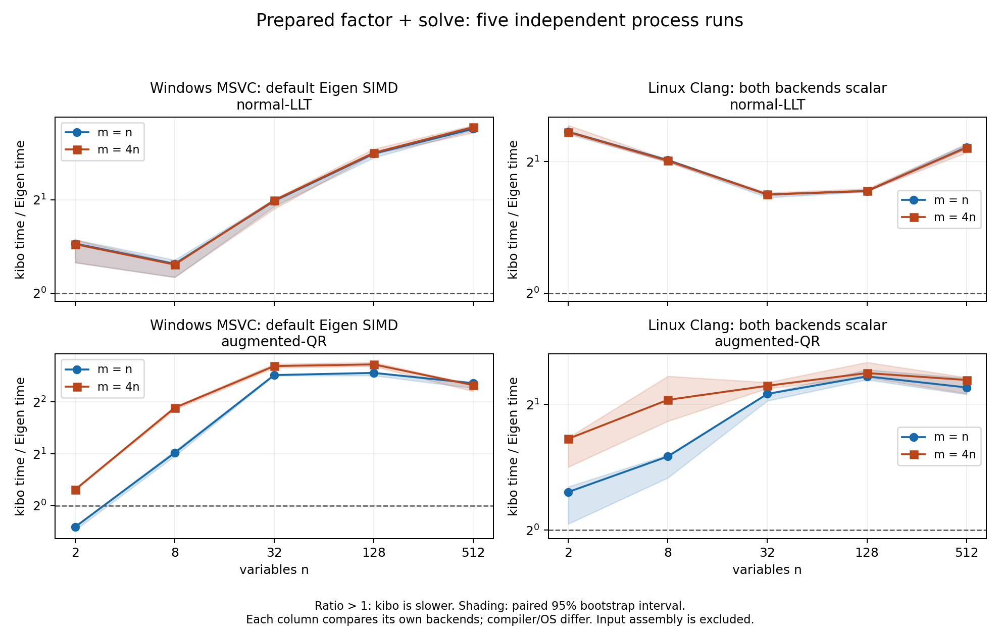

# PCの正式性能比較

2026-10-07。改善後のコアでWindows主比較とLinux scalar比較を各5 process実行した。
全10形状で通常性能fixtureの独立解照合と数値容量64 MiB以下を満たした。
悪条件・大残差の数値suiteは引き続き失敗しており、初期保証全体の受入は未完了。
この結果をEigen全体や未知のworkloadへの速度優位として一般化しない。

## Eigenに対する現在地

通常Eigen SIMDを使うWindows主比較のfactor+solveでは、20ケース中19ケースでcoreが遅い。
速かったのはn=2,m=2のaugmented-QRだけで、core/Eigen比0.754だった。
Linux scalar比較では20ケースすべてcoreが遅い。現段階で性能面の代替優位は示せていない。

代表的なn=512,m=2048のWindows主比較では、QR factor+solveが390.754 ms対78.444 ms（比4.997）、
LLTが6.770 ms対1.975 ms（比3.426）。allocation/copy込みでもQR比4.448、LLT比2.637で遅い。
QR solve単体の比は13.034だが、coreのfactor単体384.451 msに対してsolve単体4.974 msなので、
総時間を縮めるにはfactorの改善を優先して検証する根拠がある。各phaseは独立に測定している。
この比較からSIMD・blockingを候補とするが、原因や改善倍率は追加実験前に断定しない。

同時に生存する数値領域の保守的上限はcore約48.12 MiB、Eigen約58.13 MiB。
これはharnessの容量監査で、実測RSSやallocator込みのピークメモリではない。
計算時間と容量を別々に比較し、速度の不足を容量差で成功扱いにしない。

## LM参照fit

中央差分step1e-6*(1+|parameter|)、tolGradient1e-6、最大100反復、初期lambda1e-3、D=I。
受理時lambda0.3倍（下限1e-15）、棄却時10倍。両solverは同じ設定を使う評価harness。
直線は初期[0,0]、指数は初期[1,1]から、4ケースすべて2反復で受入条件を満たした。
[最終parameter/cost/iterationsのraw JSON lines](performance/lm-reference.txt)を保存した。
直線はslope1.96999995/intercept0.090000177、cost0.0155、指数はa1.00159214/b0.99961800、cost0.000262088。
optimizer製品APIとnumopt-js連携の実装は今回の範囲に含めない。

## 固定した条件

- CPU: Intel Core i9-14900K（24 cores / 32 logical processors）。
- 主比較: Windows11 Pro 10.0.26200、MSVC19.44.35222.0、Release /O2 /fp:precise、通常Eigen x64 SIMD。
- scalar比較: 同じPCのDocker Linux Debian13、Clang20.1.8/libc++20.1.8、Release -O3、両backendでSIMD自動化をoff。compiler/OS差があるため主系列と合算しない。
- Eigen5.0.1 commit bc3b39870ecb690a623a3f49149a358b95c5781d、single-thread、fast-math off。
- core source: 29739d186fefdfbd6c14899057c4f394a3f2c7ab。記録した6 sourceのSHA256をcommitのgit blobと照合した。
- xorshift seed0x6b69626f、n=2/8/32/128/512、m=n/4n、condition<=100を独立確認、lambda1e-3、D=I。両系列の10 fixture hashはすべて一致。
- warmup5、30 samples、各sample20ms以上の固定batch、backend順を交替した5 process。解を別のEigen LDLTにrelative error1e-8以内で照合してから測定。
- coreはrow-major、Eigenはcolumn-major。J/Gram/augmented入力とRHSの組立ては全phaseで時間外。LM反復全体の時間ではない。
- 中央値は5 process medianの中央値、p95は各process p95の中央値。比率は同じprocessでのcore/Eigen比の中央値。95%区間は5 paired ratiosの10000回bootstrap。
- 容量は同時に生存する入力・出力・factor・copy・workspace等に、Eigen LLT内部packingの保守的上限を補った値。allocator管理領域やmodule/OS予約は含めない。

[測定方法](../benchmarks.md)と[実compile command・binary hash](performance/build-commands.json)を参照。
未完了試行を集計せず、各系列80比較group・800 raw rowsを検証した。
集計時はraw checksum、case/run/backendの重複・欠落、時間、condition、容量を検査する。
隔離した検証で正常データを受理し、重複行・1行欠落・checksum不一致をそれぞれ拒否した。

測定後に[Eigen LLTの容量監査](../research/eigen-capacity.md)を実施し、内部packingの追加上限を全caseへ反映した。
原CSVと時間は変更せず、raw numeric_bytesは明示buffer subtotal、summary numeric_bytesは監査後の上限を示す。

## 準備済みfactor + solve

時間単位はµs。比率1超ならcoreが遅い。小さい問題でもAPI検査を含む同じ実装を比較している。
scalar時間・各phaseのmedian/p95は全結果へのリンクで確認できる。

| n | m | solver | Windows core µs | Windows Eigen µs | Windows比 [95%区間] | scalar比 [95%区間] |
| ---: | ---: | --- | ---: | ---: | --- | --- |
| 2 | 2 | normal-LLT | 0.069 | 0.047 | 1.445 [1.254, 1.487] | 2.341 [2.311, 2.353] |
| 2 | 2 | augmented-QR | 0.140 | 0.186 | 0.754 [0.722, 0.757] | 1.234 [1.035, 1.271] |
| 2 | 8 | normal-LLT | 0.068 | 0.048 | 1.438 [1.256, 1.484] | 2.338 [2.325, 2.422] |
| 2 | 8 | augmented-QR | 0.266 | 0.214 | 1.240 [1.235, 1.255] | 1.655 [1.417, 1.666] |
| 8 | 8 | normal-LLT | 0.389 | 0.312 | 1.243 [1.125, 1.280] | 2.017 [1.996, 2.019] |
| 8 | 8 | augmented-QR | 2.075 | 1.024 | 2.025 [1.938, 2.081] | 1.501 [1.335, 1.514] |
| 8 | 32 | normal-LLT | 0.388 | 0.315 | 1.236 [1.127, 1.250] | 2.010 [1.994, 2.021] |
| 8 | 32 | augmented-QR | 4.975 | 1.350 | 3.695 [3.606, 3.766] | 2.050 [1.824, 2.337] |
| 32 | 32 | normal-LLT | 5.363 | 2.706 | 1.982 [1.903, 2.004] | 1.683 [1.655, 1.686] |
| 32 | 32 | augmented-QR | 68.347 | 11.940 | 5.717 [5.683, 5.777] | 2.119 [2.040, 2.124] |
| 32 | 128 | normal-LLT | 5.380 | 2.688 | 1.992 [1.869, 2.012] | 1.682 [1.672, 1.699] |
| 32 | 128 | augmented-QR | 170.802 | 26.635 | 6.448 [6.312, 6.631] | 2.216 [2.185, 2.257] |
| 128 | 128 | normal-LLT | 126.875 | 45.039 | 2.816 [2.733, 2.835] | 1.712 [1.706, 1.722] |
| 128 | 128 | augmented-QR | 2690.344 | 460.545 | 5.888 [5.680, 5.911] | 2.334 [2.292, 2.422] |
| 128 | 512 | normal-LLT | 128.204 | 44.793 | 2.833 [2.803, 2.916] | 1.715 [1.709, 1.734] |
| 128 | 512 | augmented-QR | 7041.375 | 1068.283 | 6.591 [6.430, 6.779] | 2.377 [2.321, 2.522] |
| 512 | 512 | normal-LLT | 6751.000 | 1991.269 | 3.385 [3.350, 3.454] | 2.157 [2.137, 2.199] |
| 512 | 512 | augmented-QR | 143679.350 | 27932.900 | 5.128 [4.801, 5.200] | 2.196 [2.113, 2.312] |
| 512 | 2048 | normal-LLT | 6770.150 | 1975.216 | 3.426 [3.288, 3.472] | 2.153 [2.099, 2.189] |
| 512 | 2048 | augmented-QR | 390753.600 | 78444.000 | 4.997 [4.600, 5.048] | 2.288 [2.124, 2.320] |

[SVG](performance-comparison.svg) · [PDF](performance-comparison.pdf)

## 512変数の各phase

setupは組立て済み入力からのallocation/layout copy/factor/solveを含む。単位ms。

| 系列 | m | solver | phase | core median / p95 ms | Eigen median / p95 ms |
| --- | ---: | --- | --- | ---: | ---: |
| primary | 512 | normal-LLT | factor | 6.6604 / 6.9344 | 1.9699 / 2.0467 |
| primary | 512 | normal-LLT | solve | 0.0916 / 0.0943 | 0.0284 / 0.0292 |
| primary | 512 | normal-LLT | factor_solve | 6.7510 / 6.9939 | 1.9913 / 2.0843 |
| primary | 512 | normal-LLT | setup_copy_factor_solve | 7.3573 / 7.8839 | 2.8525 / 3.0486 |
| primary | 512 | augmented-QR | factor | 142.0430 / 150.2772 | 28.7379 / 29.7671 |
| primary | 512 | augmented-QR | solve | 1.5688 / 1.6389 | 0.1418 / 0.1498 |
| primary | 512 | augmented-QR | factor_solve | 143.6793 / 149.7907 | 27.9329 / 31.0703 |
| primary | 512 | augmented-QR | setup_copy_factor_solve | 144.8480 / 149.8464 | 31.3168 / 33.6608 |
| primary | 2048 | normal-LLT | factor | 6.6435 / 6.9357 | 1.9642 / 2.0487 |
| primary | 2048 | normal-LLT | solve | 0.0919 / 0.0962 | 0.0282 / 0.0294 |
| primary | 2048 | normal-LLT | factor_solve | 6.7702 / 7.0334 | 1.9752 / 2.1162 |
| primary | 2048 | normal-LLT | setup_copy_factor_solve | 7.3634 / 7.7016 | 2.8196 / 2.9099 |
| primary | 2048 | augmented-QR | factor | 384.4513 / 396.3771 | 79.4866 / 87.3423 |
| primary | 2048 | augmented-QR | solve | 4.9740 / 5.3663 | 0.3816 / 0.4185 |
| primary | 2048 | augmented-QR | factor_solve | 390.7536 / 404.7733 | 78.4440 / 89.5681 |
| primary | 2048 | augmented-QR | setup_copy_factor_solve | 401.3718 / 419.0066 | 89.2898 / 97.1093 |
| scalar | 512 | normal-LLT | factor | 6.1140 / 6.4958 | 2.9458 / 3.0610 |
| scalar | 512 | normal-LLT | solve | 0.1006 / 0.1064 | 0.0369 / 0.0386 |
| scalar | 512 | normal-LLT | factor_solve | 6.5124 / 6.7597 | 2.9935 / 3.1006 |
| scalar | 512 | normal-LLT | setup_copy_factor_solve | 7.1899 / 7.4117 | 3.9617 / 4.1730 |
| scalar | 512 | augmented-QR | factor | 86.5800 / 94.8837 | 38.3776 / 39.5597 |
| scalar | 512 | augmented-QR | solve | 1.2295 / 1.2543 | 0.2319 / 0.2396 |
| scalar | 512 | augmented-QR | factor_solve | 84.5344 / 89.6232 | 38.6464 / 40.2302 |
| scalar | 512 | augmented-QR | setup_copy_factor_solve | 87.7712 / 96.3566 | 39.9110 / 41.1698 |
| scalar | 2048 | normal-LLT | factor | 6.1012 / 6.4027 | 2.9543 / 3.0774 |
| scalar | 2048 | normal-LLT | solve | 0.1004 / 0.1024 | 0.0369 / 0.0378 |
| scalar | 2048 | normal-LLT | factor_solve | 6.4465 / 6.6781 | 2.9939 / 3.1542 |
| scalar | 2048 | normal-LLT | setup_copy_factor_solve | 6.4959 / 6.7942 | 3.3233 / 3.4272 |
| scalar | 2048 | augmented-QR | factor | 238.6329 / 272.7079 | 106.5441 / 112.8451 |
| scalar | 2048 | augmented-QR | solve | 5.6875 / 6.1924 | 0.6529 / 0.6944 |
| scalar | 2048 | augmented-QR | factor_solve | 245.1083 / 281.6974 | 108.5999 / 112.4395 |
| scalar | 2048 | augmented-QR | setup_copy_factor_solve | 255.2401 / 268.1582 | 119.1180 / 124.5903 |

## 容量と変更前の比較

| 系列 | coreピーク数値bytes | Eigenピーク数値bytes | gate |
| --- | ---: | ---: | --- |
| primary | 50454528 | 60952576 | <=64 MiB pass |
| scalar | 50454528 | 60952576 | <=64 MiB pass |

準備済みLLT/QRはLinux Releaseでn=2〜512・m=n/4nの10構成、Windows Debugでn<=32の6構成の計算中allocator calls=0を確認した。
Clang ASan/UBSanでも全10構成を確認した。[実commandと結果](portability/hosted/qr-locality/prepared-allocation.json)。
MSVC Releaseの確保probeはskipで、Eigenの内部確保0も保証していない。

旧5-process主比較をbefore-localityとして保持し、row-major QRの更新順を改善した後の系列とは混ぜない。
[診断](../research/qr-locality.md)は別fixtureの3回平均であり、正式値はこの表を使う。

| m / n | 変更前core factor+solve ms | 変更後core factor+solve ms | 変更前/後 |
| --- | ---: | ---: | ---: |
| 512 / 512 | 832.545 | 143.679 | 5.794 |
| 2048 / 512 | 2523.679 | 390.754 | 6.458 |

workspace=2n doubles、有限値検査、rank基準を維持した改善。次の性能改善候補はこの測定から選ぶ。
SIMD/backendやblockingの導入は別の検証対象であり、速度倍率を初期保証には加えていない。
通常hosted CIに絶対速度gateを置かず、固定PCで20%以上の悪化が95%区間込みで再現した場合にレビューする。

## 全結果・原証拠

- Windows: [summary CSV](performance/primary/summary.csv)、[JSON](performance/primary/summary.json)、[metadata](performance/primary/metadata.json)、[SHA256](performance/primary/summary-checksums.json)。
- Linux scalar: [summary CSV](performance/scalar/summary.csv)、[JSON](performance/scalar/summary.json)、[metadata](performance/scalar/metadata.json)、[SHA256](performance/scalar/summary-checksums.json)。
- 各directoryのrun-1〜5.csvはbackend/phase別のmedian・p95・batch calls・fixture hash・容量を保持する。
- [変更前の主系列](performance/before-locality/summary.csv)は履歴として保持する。未完了scalar試行と古い測定器による途中試行は正式比較へ採用しない。

この性能評価の完了だけでは、悪条件の精度gateとESP32各実機の受入を完了できない。
[初期受入状況](initial-acceptance.md)に残作業と証拠をまとめる。
